<div align="center">
  <h1>Sage MCP</h1>
  <p>
    <strong>Multi-Tenant MCP Server Platform</strong>
  </p>
  <p>
    A scalable platform for hosting MCP (Model Context Protocol) servers with OAuth integration and connector plugins.
  </p>

  [](https://opensource.org/licenses/Apache-2.0)
  [](https://www.python.org/downloads/)
  [](https://www.docker.com/)
  [](https://github.com/mvmcode/SageMCP/actions)
</div>

## About The Project

Sage MCP is a production-ready platform that enables you to run multiple isolated MCP servers with built-in OAuth authentication for services like GitHub, Jira, Slack, and more. It provides a web interface for managing tenants and connectors, making it easy to integrate Claude Desktop with various external services.

**Key Features:**
- Multi-tenant architecture with path-based isolation
- Full MCP protocol support (WebSocket, HTTP, SSE)
- OAuth 2.0 integration for secure service authentication
- Extensible plugin system for custom connectors
- React-based management interface
- Flexible database support (PostgreSQL, Supabase)

## Architecture

<div align="center">

### High-Level System Architecture

```mermaid
graph TB
    subgraph Client["Client Layer"]
        CD[Claude Desktop]
        WEB[Web Browser]
    end

    subgraph Platform["SageMCP Platform"]
        subgraph Frontend["Frontend :3001"]
            UI[React UI]
        end

        subgraph Backend["Backend :8000"]
            API[FastAPI]
            MCP[MCP Server]
            CONNECTORS["Connector Plugins
            GitHub • Jira • Slack
            Google Docs • Notion • Zoom"]
        end

        subgraph Database["Database"]
            DB[("PostgreSQL /
            Supabase")]
        end
    end

    subgraph External["External Services"]
        EXT["GitHub • Slack • Jira
        Google • Notion • Zoom APIs"]
    end

    CD -->|WebSocket/HTTP| MCP
    WEB -->|HTTPS| UI
    UI -->|REST API| API
    MCP -->|Execute Tools| CONNECTORS
    API -->|ORM| DB
    CONNECTORS -->|OAuth| EXT

    style CD fill:#e1f5ff
    style WEB fill:#e1f5ff
    style UI fill:#fff3e0
    style API fill:#f3e5f5
    style MCP fill:#e8f5e9
    style CONNECTORS fill:#e8f5e9
    style DB fill:#fce4ec
    style EXT fill:#e0f2f1
```



**[📖 View Full Architecture Documentation →](docs/architecture.md)** | Includes 10+ detailed diagrams covering OAuth flows, multi-tenancy, database schema, deployment, and more.

</div>

**Architecture Highlights:**
- **Multi-tenant isolation** with path-based routing (`/api/v1/{tenant_slug}/mcp`)
- **Plugin-based connectors** for extensibility (6 connectors with 87+ tools)
- **OAuth 2.0 authentication** per tenant with encrypted credential storage
- **Async I/O** throughout the stack for high performance
- **Horizontal scaling** ready via Kubernetes with Helm charts

### Built With

* [FastAPI](https://fastapi.tiangolo.com/) - Backend framework
* [React](https://reactjs.org/) - Frontend interface
* [SQLAlchemy](https://www.sqlalchemy.org/) - Database ORM
* [MCP](https://modelcontextprotocol.io/) - Model Context Protocol
* [Docker](https://www.docker.com/) - Containerization

## Getting Started

### Prerequisites

- Docker and Docker Compose
- Python 3.11+ (for local development)
- PostgreSQL or Supabase account

### Installation

1. **Clone the repository**
   ```bash
   git clone https://github.com/mvmcode/SageMCP.git
   cd SageMCP
   ```

2. **Setup environment**
   ```bash
   cp .env.example .env
   # Edit .env with your OAuth credentials (optional for testing)
   ```

3. **Start the platform**
   ```bash
   make setup
   make up
   ```

4. **Access the application**
   - Frontend: http://localhost:3001
   - API: http://localhost:8000
   - API Docs: http://localhost:8000/docs

## Usage

### Quick Start

1. Open the web interface at http://localhost:3001
2. Create a new tenant
3. Add a connector (e.g., GitHub) and configure OAuth
4. Copy the MCP server URL for Claude Desktop

### Claude Desktop Configuration

Add to your Claude Desktop config:

```json
{
  "mcpServers": {
    "sage-mcp": {
      "command": "npx",
      "args": ["-y", "@modelcontextprotocol/server-everything"],
      "env": {
        "MCP_SERVER_URL": "ws://localhost:8000/api/v1/{tenant-slug}/mcp"
      }
    }
  }
}
```

### Supported Connectors

Sage MCP provides production-ready connectors for popular development and collaboration tools. Each connector includes full OAuth 2.0 integration and comprehensive tool coverage.

### User-Level OAuth Tokens

SageMCP supports both **tenant-level** and **user-level** OAuth authentication:

- **Tenant-level OAuth** (default): Single OAuth credential shared by all users in a tenant
- **User-level OAuth**: Each user passes their own OAuth token per request

**HTTP POST requests** (use custom header):
```bash
curl -X POST http://localhost:8000/api/v1/{tenant-slug}/connectors/{connector-id}/mcp \
  -H "X-User-OAuth-Token: <user-oauth-token>" \
  -H "Content-Type: application/json" \
  -d '{"jsonrpc":"2.0","id":1,"method":"tools/list","params":{}}'
```

**WebSocket connections** (use extension message):
```javascript
const ws = new WebSocket('ws://localhost:8000/api/v1/{tenant-slug}/connectors/{connector-id}/mcp');

ws.onopen = () => {
  // Set user token before initialize
  ws.send(JSON.stringify({
    jsonrpc: '2.0',
    method: 'auth/setUserToken',
    params: { token: '<user-oauth-token>' }
  }));

  // Then proceed with normal MCP flow
  ws.send(JSON.stringify({
    jsonrpc: '2.0',
    id: 1,
    method: 'initialize',
    params: { protocolVersion: '2024-11-05' }
  }));
};
```

**Priority**: User token (if provided) → Tenant credential (fallback)

**Use cases:**
- Multi-user SaaS apps where each user needs their own OAuth identity
- Testing with different user accounts
- Per-user access control and audit trails

**Note**: User tokens are for external APIs (GitHub, Slack, etc.), separate from MCP protocol-level authentication.

<div align="left">

####  GitHub
**24 tools** for complete repository management
- Repositories, issues, pull requests, and releases
- Commits, branches, and comparisons
- GitHub Actions workflows and runs
- User and organization management
- [Full Documentation →](docs/connectors/github.md)

####  Jira
**20 tools** for agile project management
- Issue creation, updates, and JQL search
- Sprint and board management
- Workflow transitions and comments
- Project and version tracking
- [Full Documentation →](docs/connectors/jira.md)

####  Slack
**11 tools** for workspace communication
- Send and read messages in channels
- Thread conversations and search
- User and channel management
- Emoji reactions and rich formatting
- [Full Documentation →](docs/connectors/slack.md)

####  Google Docs
**10 tools** for document management
- Create, read, and update documents
- Search and list accessible documents
- Export documents in multiple formats
- Manage sharing permissions
- [Full Documentation →](docs/connectors/google-docs.md)

####  Notion
**10 tools** for workspace collaboration
- Access databases, pages, and blocks
- Search and query database entries
- Create and update pages with content
- Read structured and plain text content
- [Full Documentation →](docs/connectors/notion.md)

####  Zoom
**12 tools** for video conferencing
- Manage meetings, webinars, and recordings
- Create and update scheduled meetings
- Access cloud recordings and download links
- View meeting participants and invitations
- [Full Documentation →](docs/connectors/zoom.md)

</div>

**Coming Soon**
- GitLab
- Linear
- Confluence

For general OAuth setup guidance, see the [OAuth Configuration Guide](.github/docs/oauth-setup.md).

## Development

### Running Tests

```bash
# Backend tests
make test-backend

# Frontend tests
make test-frontend

# All tests with coverage
make test-coverage
```

### Available Commands

```bash
make help            # Show all available commands
make build           # Build Docker images
make up              # Start all services
make down            # Stop all services
make logs            # View logs
make shell           # Open shell in app container
make clean           # Clean up containers and volumes
```

### Adding New Connectors

1. Create a new connector class in `src/sage_mcp/connectors/`
2. Implement the `BaseConnector` interface
3. Register with `@register_connector` decorator
4. Add to the connector enum

See existing connectors in `src/sage_mcp/connectors/` for examples.

## Deployment

### Docker Compose (Development)
```bash
make up
```

### Kubernetes (Production)

Deploy with PostgreSQL:
```bash
helm install sage-mcp ./helm
```

Deploy with Supabase:
```bash
helm install sage-mcp ./helm \
  --set database.provider=supabase \
  --set postgresql.enabled=false \
  --set supabase.url=https://your-project.supabase.co \
  --set supabase.serviceRoleKey=your-service-role-key
```

## Roadmap

- [x] Multi-tenant MCP server
- [x] GitHub connector with OAuth
- [x] Jira connector with OAuth
- [x] Slack connector with OAuth
- [x] Google Docs connector with OAuth
- [x] React management interface
- [x] PostgreSQL and Supabase support
- [x] Kubernetes deployment
- [ ] GitLab connector
- [ ] Notion connector
- [ ] Linear connector
- [ ] Advanced connector configuration

See the [open issues](https://github.com/mvmcode/SageMCP/issues) for a full list of proposed features and known issues.

## Contributing

Contributions are what make the open source community amazing! Any contributions you make are **greatly appreciated**.

1. Fork the Project
2. Create your Feature Branch (`git checkout -b feature/AmazingFeature`)
3. Commit your Changes (`git commit -m 'Add some AmazingFeature'`)
4. Push to the Branch (`git push origin feature/AmazingFeature`)
5. Open a Pull Request

## License

Distributed under the Apache 2.0 License. See `LICENSE` for more information.

## Contact

- Project Link: [https://github.com/mvmcode/SageMCP](https://github.com/mvmcode/SageMCP)
- Discord Community: [https://discord.gg/kpHzRzmy](https://discord.gg/kpHzRzmy)

## Acknowledgments

* [Model Context Protocol](https://modelcontextprotocol.io/)
* [FastAPI](https://fastapi.tiangolo.com/)
* [Claude Desktop](https://claude.ai/)
* [Best-README-Template](https://github.com/othneildrew/Best-README-Template)

---

<div align="center">
  Built with FastAPI, React, and the MCP Protocol
</div>
