# SageMCP Architecture

## High-Level System Architecture

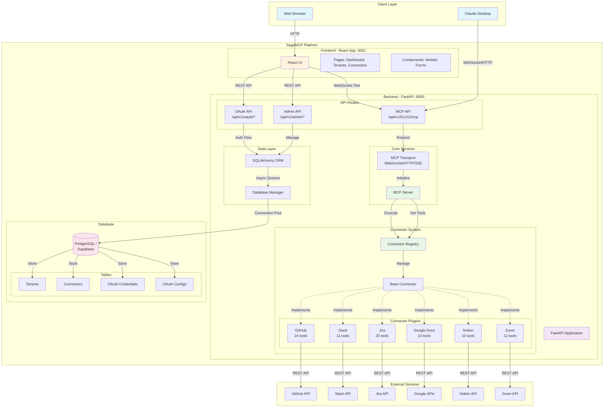

## Multi-Tenant Architecture

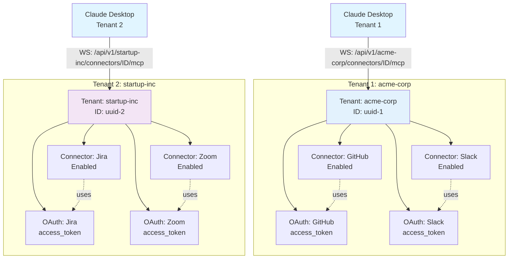

## OAuth Authentication Flow

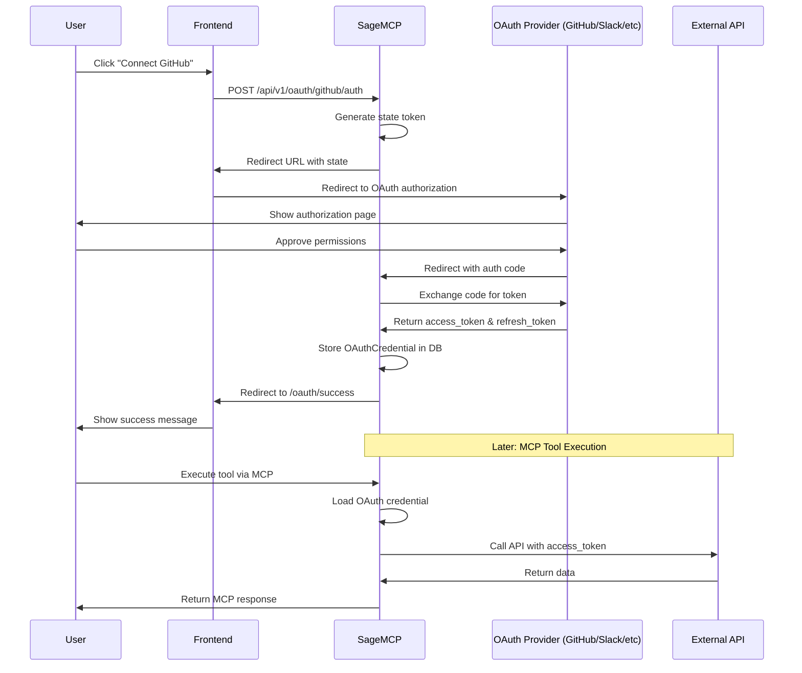

## MCP Tool Execution Flow

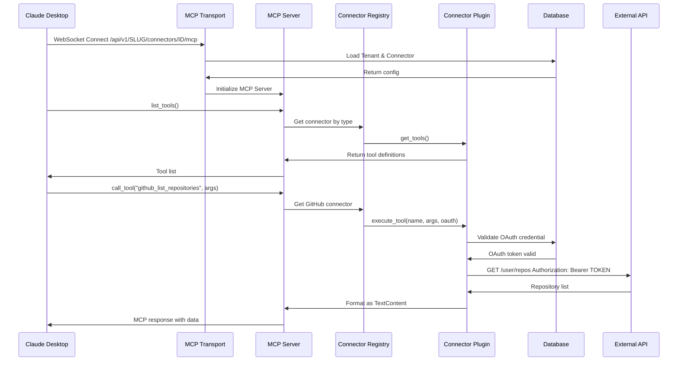

## Database Schema

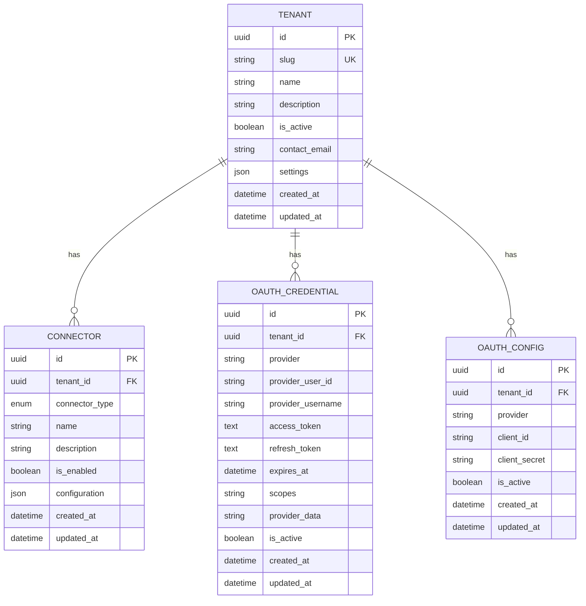

## Connector Plugin Architecture

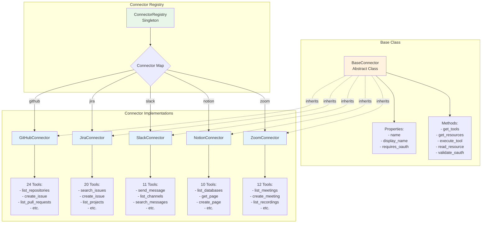

## Request Flow: Creating and Using a Connector

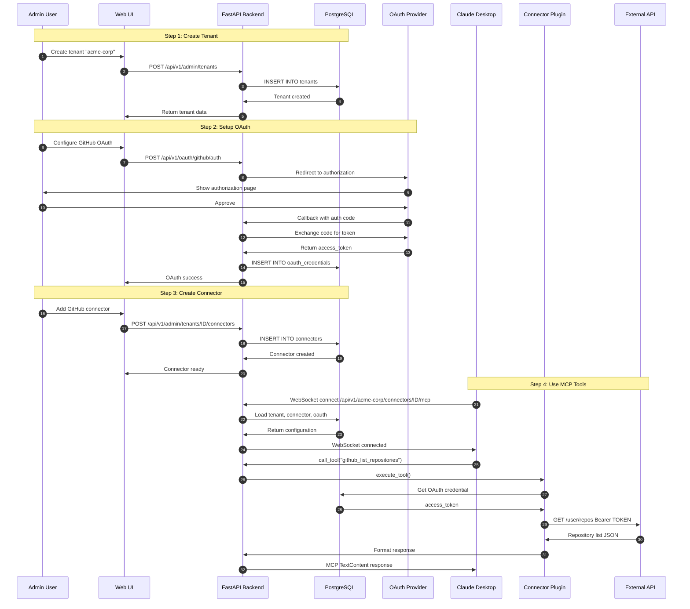

## Technology Stack

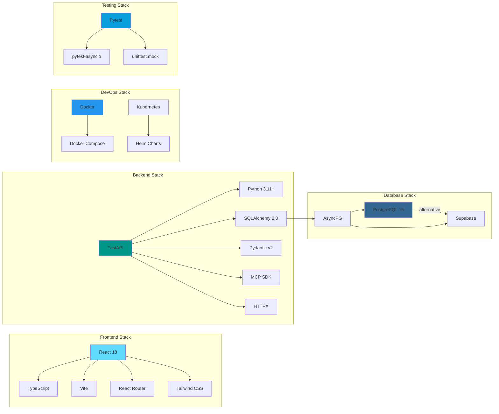

## Deployment Architecture

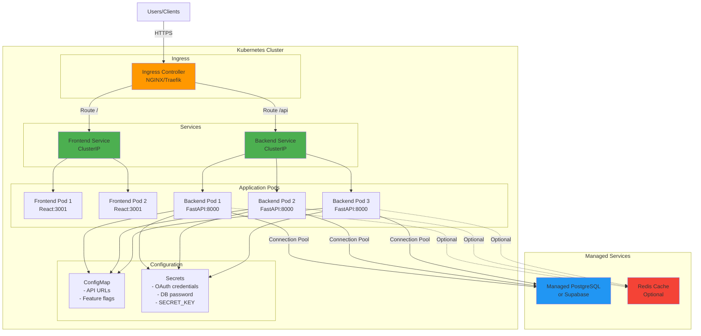

## Key Design Patterns

### 1. **Plugin Architecture**
- Connectors are dynamically registered via decorators
- All connectors inherit from `BaseConnector` abstract class
- Registry pattern for connector discovery and instantiation

### 2. **Multi-Tenancy**
- Path-based tenant isolation (`/api/v1/{tenant_slug}`)
- Foreign key relationships ensure data segregation
- Each tenant has isolated OAuth credentials and connectors

### 3. **Repository Pattern**
- SQLAlchemy ORM abstracts database operations
- Async database access via `asyncpg`
- Connection pooling for performance

### 4. **Factory Pattern**
- `MCPServer` factory creates server instances per request
- Connector factory creates connector instances from registry

### 5. **Decorator Pattern**
- `@register_connector` decorator for plugin registration
- FastAPI route decorators for API endpoints

### 6. **Adapter Pattern**
- Connectors adapt external APIs to MCP protocol
- Each connector translates between MCP tools and provider-specific APIs

## Security Architecture

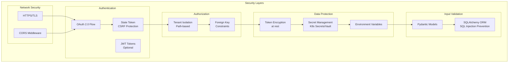

## Performance Considerations

### Connection Pooling
- SQLAlchemy async engine with connection pool (default: 5-20 connections)
- HTTPX async client for external API calls
- WebSocket connection reuse for MCP protocol

### Caching Strategy (Optional)
- Redis for session data
- In-memory connector registry (singleton)
- OAuth token caching with TTL

### Scalability
- Horizontal scaling via Kubernetes replicas
- Stateless backend design (WebSocket state in transport layer)
- Database connection pooling
- Async I/O throughout the stack

## Monitoring & Observability

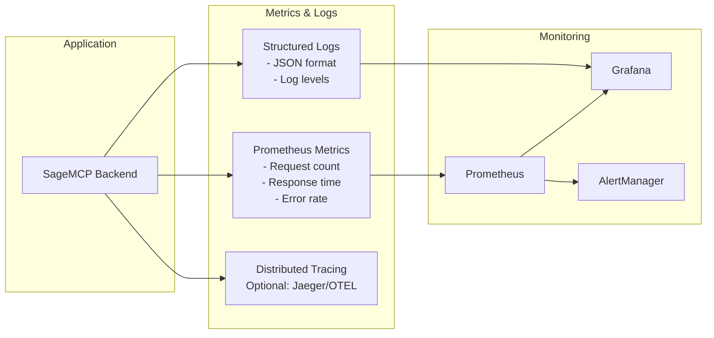

---

## Summary

SageMCP is a **multi-tenant MCP server platform** that enables Claude Desktop to connect to external services via OAuth-authenticated connectors. The architecture is:

- **Modular**: Plugin-based connector system
- **Scalable**: Async I/O, connection pooling, horizontal scaling
- **Secure**: OAuth 2.0, tenant isolation, token encryption
- **Extensible**: Easy to add new connectors following the base pattern
- **Production-ready**: Docker/Kubernetes deployment, comprehensive testing

The platform successfully bridges Claude Desktop's MCP protocol with external service APIs (GitHub, Slack, Jira, Google Docs, Notion, Zoom) through a unified, tenant-aware interface.
